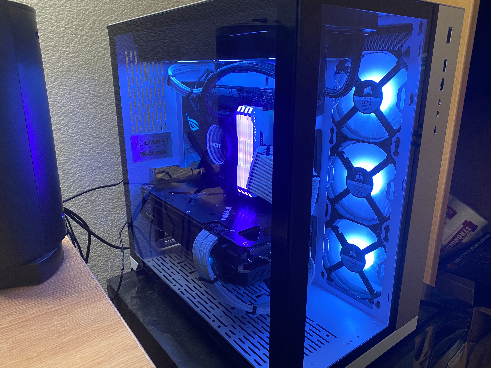

# Nicholas Masumoto
## Programming
#### Programming Languages that I Have Used
- Java
- C++
- Python


#### Programming Languages that I Experimented With
- HTML
- CSS
- JavaScript

##### Funny Progamming Quote
Jeff Sickel:

> Deleted code is debugged code.

##### Hello World! in Java
```
class HelloWorld{
    public static void main(String args[]){
        System.out.println("Hello World!");
    }
}
```

## Hobbies
1. Video Games
   - League of Legends
   - Genshin Impact
   - Beat Saber
   - My [Steam Account](https://steamcommunity.com/profiles/76561198151230179/).
2. Watching Anime
   - Favorite Anime
      - Haikyuu
   - [MyAnimeList](https://myanimelist.net/profile/littlemasu)
3. Building Computers
   
      - [x] **CPU:** Ryzen 9 5900x
      - [x] **GPU:** Radeon 6800xt
      - [x] **Motherboard:** Asus Rog Strix x570
      - [ ] **Custom Water Cooling:**


#### Link to README.md
[README.md](README.md)

